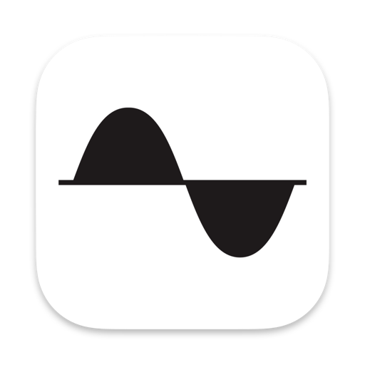
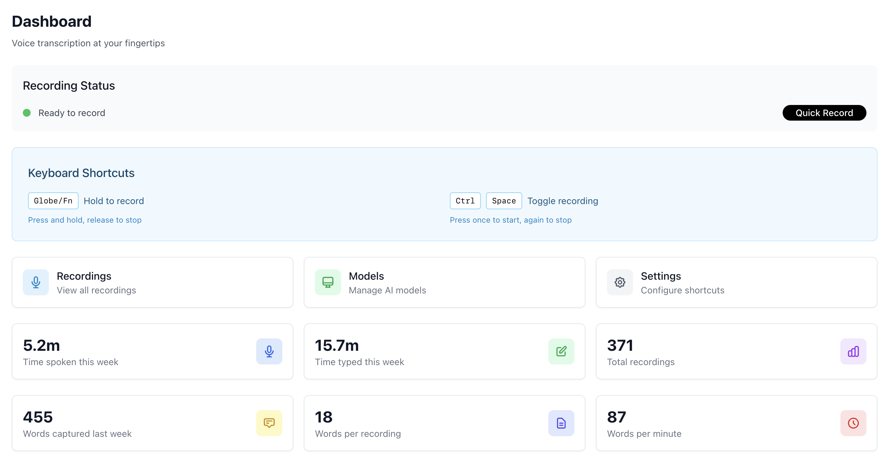
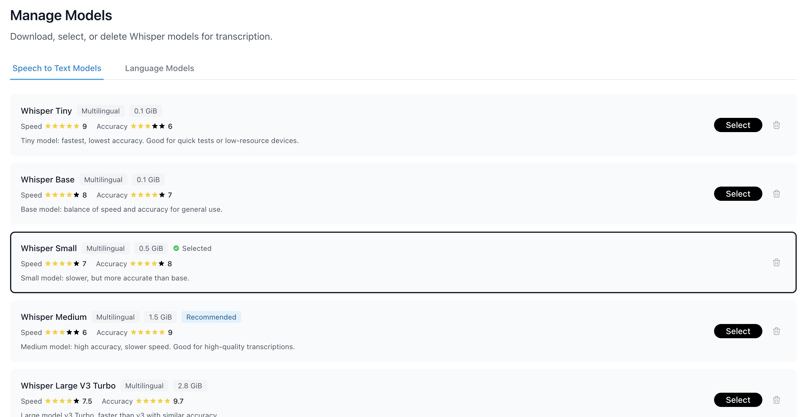
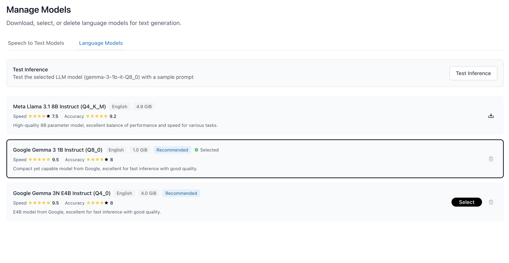
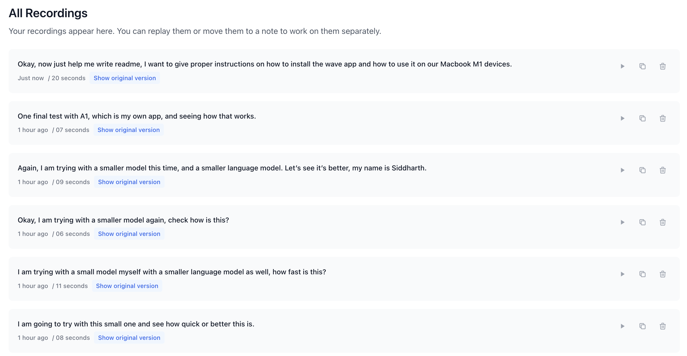
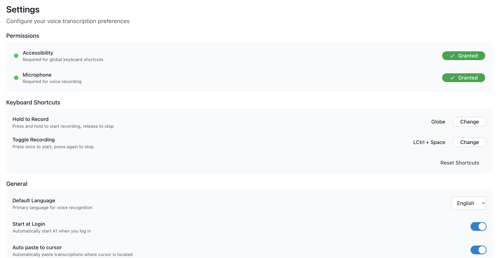
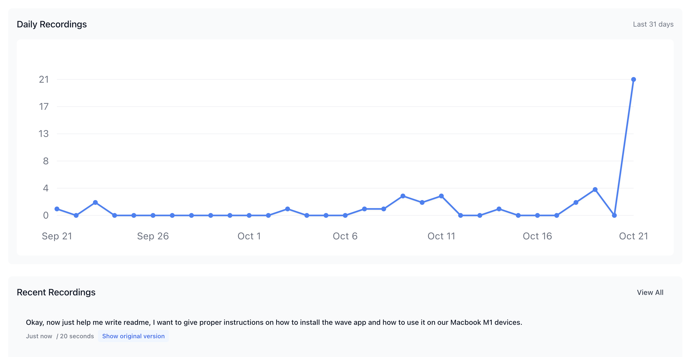

# Wave - AI-Powered Voice Transcription App

<div align="center">



<br />
<br />

A fast, private, and offline-first voice transcription app for macOS that runs entirely on your machine.

Made with ❤️ by [siddg.com](https://www.siddg.com)

<br />

[Features](#features) • [Installation](#installation) • [Usage](#usage) • [Development](#development) • [Contributing](#contributing)

</div>

---

## 📸 Screenshots

### Dashboard


### Speech-to-Text Models


### LLM Models


### Recordings


### Settings


### Analytics


---

## ✨ Features

### 🎤 Voice Recording & Transcription
- **Global Keyboard Shortcuts** - Record with customizable hold or toggle shortcuts
- **Real-time Transcription** - Using Whisper AI models (tiny, base, small, medium, large-v3-turbo)
- **Floating Recording Pill** - Visual feedback during recording across all workspaces
- **Audio Feedback** - Configurable sounds for recording start/stop

### 🤖 AI Enhancement (Optional)
- **LLM Post-Processing** - Clean up transcriptions with local LLM models
- **Grammar & Punctuation** - Automatic fixes without changing meaning
- **Customizable Prompts** - Define your own enhancement rules
- **Supported Models**: Gemma 2B, Llama 3.2 1B/3B, Qwen 2.5 0.5B/1.5B/3B

### 📋 Smart Text Handling
- **Auto-paste to Cursor** - Instantly paste transcribed text where you're typing
- **Clipboard Copy** - Automatically copy to clipboard
- **Recording History** - View, search, and replay all your recordings
- **Original + Enhanced Text** - Keep both versions for comparison

### 🔒 Privacy First
- **100% Offline** - All processing happens on your machine
- **No Cloud** - Your voice data never leaves your computer
- **No Analytics** - No tracking, no telemetry
- **Local Storage** - All recordings stored locally with configurable retention

### ⚙️ Customization
- **Model Selection** - Choose speed vs accuracy trade-offs
- **Keyboard Shortcuts** - Customize hold or toggle recording shortcuts
- **Auto Cleanup** - Configure data retention (7 days to forever)
- **Audio Settings** - Enable/disable sound effects
- **Start at Login** - Launch Wave automatically on system startup

---

## 🚀 Installation

### Download Pre-built App (Recommended)

1. Download the latest `.dmg` file from the [Releases](https://github.com/siddug/wave/releases) page
2. Open the `.dmg` file
3. Drag Wave to your Applications folder
4. Launch Wave from Applications

### First Launch Setup

1. **Grant Permissions** - Wave needs:
   - 🎤 **Microphone Access** - For recording your voice
   - ♿ **Accessibility Access** - For keyboard shortcuts and auto-pasting

2. **Download AI Models**:
   - Navigate to **Models** page
   - Download at least one Whisper model (recommended: `base` for balance)
   - Optionally download an LLM model for enhanced transcriptions

3. **Configure Shortcuts**:
   - Go to **Settings** → **Keyboard Shortcuts**
   - Set your preferred recording shortcut (default: Globe key)
   - Choose between Hold (press and hold) or Toggle (press to start/stop)

4. **You're Ready!** - Try recording by pressing your configured shortcut

---

## 🎯 Usage

### Recording Voice

#### Method 1: Keyboard Shortcut (Default)
1. Press and hold your configured shortcut key (default: **Globe** key)
2. Speak your text
3. Release the key to stop recording
4. Wave will transcribe and paste the text at your cursor

#### Method 2: Toggle Mode
1. Set toggle shortcut in Settings (e.g., **Cmd+Shift+Space**)
2. Press once to start recording
3. Press again to stop
4. Text appears at your cursor location

### Managing Recordings

- **View All**: Navigate to **Recordings** page
- **Play Back**: Click any recording to hear the original audio
- **Copy Text**: Click the copy icon to copy transcription
- **Delete**: Swipe left or click delete icon
- **Search**: Use the search bar to find specific recordings

### Customizing Models

#### Whisper Models (Required)
Choose based on your needs:

| Model | Speed | Accuracy | Size | Best For |
|-------|-------|----------|------|----------|
| Tiny | ⚡⚡⚡⚡⚡ | ⭐⭐ | 75 MB | Quick notes, simple commands |
| Base | ⚡⚡⚡⚡ | ⭐⭐⭐ | 142 MB | **Recommended for most users** |
| Small | ⚡⚡⚡ | ⭐⭐⭐⭐ | 466 MB | Professional transcription |
| Medium | ⚡⚡ | ⭐⭐⭐⭐⭐ | 1.5 GB | High accuracy needs |
| Large-v3-turbo | ⚡⚡⚡ | ⭐⭐⭐⭐⭐ | 1.6 GB | Best quality, fast for large |

#### LLM Models (Optional Enhancement)
Improve transcription quality:

| Model | Speed | Quality | Size | Best For |
|-------|-------|---------|------|----------|
| Qwen 2.5 0.5B | ⚡⚡⚡⚡⚡ | ⭐⭐⭐ | 352 MB | Fast, light cleanup |
| Gemma 2B | ⚡⚡⚡⚡ | ⭐⭐⭐⭐ | 1.6 GB | Balanced performance |
| Llama 3.2 3B | ⚡⚡⚡ | ⭐⭐⭐⭐⭐ | 2.0 GB | Best quality |

---

## ⚙️ Settings Guide

### Recording Settings
- **Copy to Clipboard** - Auto-copy transcriptions to clipboard
- **Auto-paste to Cursor** - Paste text where you're typing
- **Play Audio Feedback** - Enable/disable sounds

### Model Settings
- **Whisper Model** - Select transcription model
- **LLM Model** - Select enhancement model (optional)
- **Enhanced Prompts** - Toggle LLM post-processing

### Keyboard Shortcuts
- **Hold Shortcut** - Press and hold to record
- **Toggle Shortcut** - Press once to start, again to stop
- **Record New Shortcut** - Click to capture new key combination

### Storage & Privacy
- **Storage History** - How long to keep recordings
  - 7 days, 14 days, 1 month, 2 months, 6 months, Forever
- **Auto Cleanup** - Automatically delete old recordings
- **Manual Cleanup** - Delete recordings older than selected period

### General Settings
- **Start at Login** - Launch Wave when you log in
- **Show in Dock** - Always visible (currently always on)

---

## 🛠️ Development

### Prerequisites
- macOS 10.13 or later
- Node.js v16 or higher
- npm or yarn
- M-series Mac

### Building from Source

```bash
# Clone the repository
git clone https://github.com/siddug/wave.git
cd wave

# Install dependencies
npm install

# Run in development mode
npm run dev
```

### Project Structure

```
wave/
├── src/
│   ├── electron/              # Electron main process
│   │   ├── main.js           # App entry point, IPC handlers
│   │   ├── preload.js        # Secure IPC bridge
│   │   ├── audioService.js   # Audio recording logic
│   │   └── llmService.js     # LLM integration
│   ├── native/               # Native Swift integrations
│   │   ├── keyboard_listener.swift  # Global shortcuts
│   │   └── text_paster.swift        # Auto-paste functionality
│   ├── react/                # React frontend
│   │   ├── components/       # UI components
│   │   ├── pages/           # App pages
│   │   ├── store/           # Redux state management
│   │   └── hooks/           # Custom React hooks
│   └── assets/              # Icons, images, sounds
├── forge.config.js          # Electron Forge configuration
├── package.json
└── README.md
```

### Available Scripts

```bash
# Development
npm run dev              # Start both React dev server and Electron
npm run dev:react        # Start only React dev server
npm run dev:electron     # Start only Electron

# Building
npm run build           # Build React app
npm run clean           # Clean build artifacts
npm run package         # Package app (no installer)
npm run make            # Build distributable DMG

# Platform-specific builds
npm run make:mac-arm64  # Build for Apple Silicon (M1/M2/M3)
npm run make:mac-x64    # Build for Intel Macs
```

### Building Distribution Package

```bash
# Clean previous builds
npm run clean

# Build and create DMG
npm run make:mac-arm64

# Find your built app in:
# out/Wave-darwin-arm64/Wave.app
# out/make/Wave-{version}-arm64.dmg
```

### Code Signing & Notarization (Optional)

For distribution, you'll need an Apple Developer account. Create a `.env` file:

```bash
# .env
MAC_CODESIGN_IDENTITY="Developer ID Application: Your Name (TEAM_ID)"
APPLE_ID="your-apple-id@example.com"
APPLE_PASSWORD="app-specific-password"
APPLE_TEAM_ID="YOUR_TEAM_ID"
```

Then build normally - signing and notarization happen automatically.

---

## 🔧 Technical Details

### AI Models
- **Whisper** - OpenAI's speech recognition (via whisper.cpp)
- **LLM** - Local language models (via node-llama-cpp)
- **Processing** - 100% offline, Metal-accelerated on Apple Silicon

### Architecture
- **Frontend** - React 18, Redux Saga, Tailwind CSS
- **Backend** - Electron 28, Node.js
- **IPC** - Context-isolated, secure communication
- **Storage** - electron-store for settings, file system for recordings
- **Audio** - Web Audio API, ffmpeg for processing

### System Requirements
- macOS 10.13 (High Sierra) or later
- 4 GB RAM minimum (8 GB recommended for LLM models)
- 2 GB free disk space (more for model storage)
- Apple Silicon (M1/M2/M3). Haven't tested in Intel models.

---

## 🤝 Contributing

Contributions are welcome! Here's how you can help:

1. **Fork the Repository**
2. **Create a Feature Branch** (`git checkout -b feature/amazing-feature`)
3. **Commit Changes** (`git commit -m 'Add amazing feature'`)
4. **Push to Branch** (`git push origin feature/amazing-feature`)
5. **Open a Pull Request**

### Reporting Issues

Found a bug? Have a feature request? Please [open an issue](https://github.com/siddug/wave/issues) with:
- Clear description
- Steps to reproduce (for bugs)
- Expected vs actual behavior
- Your macOS version and Wave version

---

## 📝 License

This project is licensed under the MIT License - see the [LICENSE](LICENSE) file for details.

---

## 🙏 Acknowledgments

- **Whisper.cpp** - Speech recognition by Georgi Gerganov
- **node-llama-cpp** - LLM integration by withcatai
- **Electron** - Cross-platform desktop framework
- **React** - UI library by Meta

---

<div align="center">

Made with ❤️ for privacy-conscious users by siddg.com

[⬆ Back to Top](#wave---ai-powered-voice-transcription-app)

</div>
